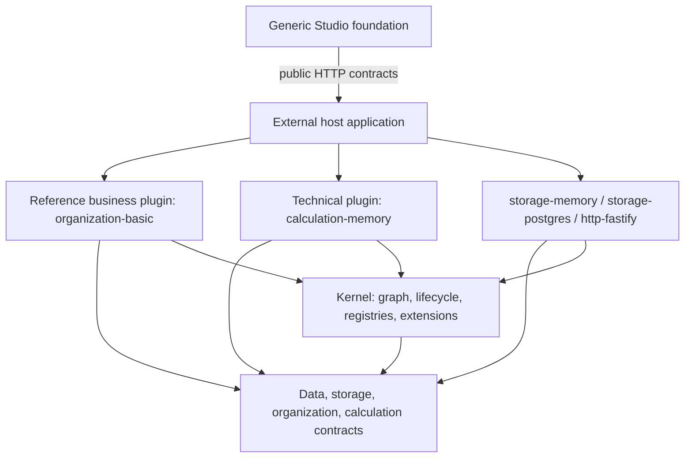

# Architecture

Prism Core composes a generic Kernel, typed contracts, selectable plugin implementations, and host-owned exposure. It is Apache-2.0 open source and remains independently useful without any private Solution (`LICENSE`, `NOTICE`, `docs/adr/0014-open-core-private-solutions.md`).

## Repository boundary

Hospital Performance is a separate private/commercial consumer. Core contains no hospital schemes, rules, pipelines, data adapters, customer UI or deployment configuration. A missing generic mechanism is implemented and released from Core before a Solution consumes it.

```text
Prism Core (this repository)
  Kernel / contracts / providers / testing / generic Studio
              │ public versioned packages
              ▼
Private Solutions (separate repositories)
  domain plugins / rules / adapters / customer UI / deployment
```

## Layers



Dependency direction is one-way. Kernel has no HTTP, PostgreSQL, Organization, Pipeline, Studio or domain concept. Typed extension points let plugins register routes, calculation operations and backends without adding those concepts to Kernel.

## Capability and Plugin

A Capability is a typed contract identified by a stable token ID and versioned separately from implementation packaging. A Plugin is one concrete provider/consumer and lifecycle boundary.

Rules:

1. The host supplies plugins explicitly; V0.1 has no runtime package download.
2. Consumers declare Capability requirements, never concrete provider packages.
3. One Capability ID has one provider in a composed graph.
4. Undeclared service access throws `CAPABILITY_UNDECLARED_ACCESS`.
5. Provider suffixes are deliberate: `storage.memory`, `storage.postgres`, `calculation.memory`, `organization.basic`, `http.fastify`.
6. Plugin internals remain normal modules; a service/repository/entity/helper is not automatically a Plugin.
7. The host may access composed capabilities because it owns the graph; plugins remain restricted to `requires`.

## Kernel boundary

Kernel owns:

```text
Plugin model and lifecycle
Capability registry and semver resolution
Dependency graph and cycle rejection
Runtime Context
Resource/configuration/presentation registries
Typed extension registry
Diagnostics and inspection
Bootstrap and cleanup
```

Kernel refuses to know:

```text
HTTP / Fastify
PostgreSQL / Kysely
Organization domain
Pipeline operators and physical backends
Studio/Vue
private Solution concepts
```

## Lifecycle

```text
discover -> resolve -> register -> migrate -> start -> stop
```

- Resolution validates plugin IDs, missing/duplicate providers, semver ranges and cycles before callbacks.
- Register provides capabilities and contributes resource/extension definitions.
- Capability registration freezes before start.
- Providers start before consumers and stop in reverse order.
- On register/start failure Kernel invokes `stop` for the failing plugin, cleans earlier runtimes in reverse order, and rebuilds registries before retry.
- `bootId` increments after each successful boot so cross-boot caches can invalidate.
- Event subscriptions and the migration journal survive a boot cycle; capability/resource/extension/diagnostic stores do not.

External side effects inside `register` are not automatically transactional. Plugins must make `stop` safe after partial initialization.

## Configuration, service and presentation

`Service Contract` is the normal typed API used by programmers. `ConfigurationContract<TSpec>` defines the JSON-editable behavior exposed to business users. `PresentationSpec` supplies labels, help, grouping, ordering and editor hints without changing semantics.

```text
Presentation -> Configuration Contract -> Capability -> Kernel
```

No service automatically becomes an API, pipeline node or page. Exposure is deny-by-default. V0.1 enforces:

- `configuration` for generic Resource discovery/creation;
- `pipeline` for the operation palette.

Other exposure names are reserved metadata. HTTP exists only through explicit route contributions.

## JSON persistence boundary

Resource specs and documents are `JsonValue`. Both storage providers call the same `assertJsonValue` guard. It rejects values JSON cannot preserve honestly: `undefined`, non-finite number, `bigint`, function, symbol, `Date`, `Decimal` and class instances.

Domain objects cross persistence through paired codecs:

```text
Domain value -> Codec.encode -> JsonValue -> provider
provider -> JsonValue -> Codec.decode -> Domain value
```

Memory does not define looser semantics than PostgreSQL. This rule was introduced after in-memory object retention hid prototype-loss bugs that a real JSONB round trip exposed (`packages/contracts-data/src/json.ts`, `packages/plugin-storage-memory/src/memory-storage.ts`).

## Resource revisions and PostgreSQL

Logical identity and revision content are separate:

```text
resource(kind, id, current_revision, timestamps)
resource_revision(kind, id, revision, status, name, spec jsonb, timestamps)
document(collection, id, body jsonb, timestamps)
prism_migration(plugin_id, migration_id, applied_at)
```

Lifecycle:

```text
draft -> published -> archived
draft ----------------> archived
```

Published content is permanently immutable. PostgreSQL enforces this with a `BEFORE UPDATE` trigger; it also blocks published-to-draft and every transition out of archived, closing two-step thaw/mutate attacks. `0002_immutable_revision_status` updates already-migrated databases rather than silently editing `0001` (`packages/plugin-storage-postgres/src/migrations.ts`).

Migrations belong to the plugin that owns the tables. Kernel orders/runs them and writes successful IDs through a journal. V0.1 migrations are forward-only and must be idempotent. A journal created from a connection string owns a separate pool; its creator calls `dispose()`.

`storage.atomic-write` accepts a declaration of document preconditions and put/delete operations. It never exposes a transaction callback or provider client. One provider executes one plan: memory applies it to temporary collection copies before swapping them, while PostgreSQL evaluates it inside one database transaction with advisory locks for absent-document races. Cross-provider transactions and Resource mutations are outside the V1 contract.

Memory and PostgreSQL import one provider-independent `describeStorageContract` suite. CI uses real PostgreSQL 17 and fails if the persistence suite executes zero tests.

## Arrow Dataset boundary

`Dataset.stream()` yields Arrow-backed `DataBatch`, not `Row[]`. Logical Prism schemas map to Arrow schema/metadata; decimal columns carry required precision and scale. `Row[]` remains an explicit materialization escape hatch for JSON edges, fixtures and the current row-oriented memory backend.

Domain point queries may return objects/maps while batch consumers use Dataset. This avoids per-row Capability and future FFI calls.

## Calculation

```text
PipelineSpec
    ↓ infer / normalize / lower
SemanticPlan       serializable, deterministic, typed, versioned
    ↓ backend lowering
ExecutablePlan
    ↓
CalculationBackend
```

Operations infer and lower; they do not execute. SemanticPlan contains no closure or runtime object. MemoryBackend owns JS evaluators internally. V0.1 selects one backend for the whole plan; arbitrary node-level backend hopping is deferred.

The calculation contract includes safe expression AST, Join cardinality checks, first-class Lookup policies, ordered Decision, exact Decimal Aggregate, conservation-preserving Allocate, Validate, trace and explain metadata.

Optional compiler semantics use public extension contracts, not Kernel branches. Type and Plan analyzers return explicit `not-applicable | handled | invalid`; multiple handlers conflict, required analyzers cannot disappear silently, and exact extension contract plus analyzer semantic versions enter SemanticPlan v2 and `planHash`. Typed `SemanticAnnotation<JsonValue>` facts survive Arrow/JSON round trips. Static analyzers may also emit `PlanConstraint` records for Snapshot/Runtime enforcement of actual data facts; Runtime does not re-infer static meaning (`packages/contracts-calculation/src/analysis.ts`, `packages/contracts-data/src/semantic-annotation.ts`, `packages/plugin-calculation-memory/src/analysis.ts`, `docs/adr/0015-compiler-semantics-are-plugin-extensions.md`).

## Run evidence

Core defines evidence structures independent of any domain Solution:

```text
Run identity =
  DefinitionRef + DefinitionFingerprint
  + Dataset/Parameter fingerprints
  + Effective time
  + Engine/Operation/Backend/Business-component versions
  + Semantic plan hash
```

A definition reference locates content; its fingerprint verifies content. Parameter declarations affect plan identity; bound values affect input identity. Backend and business-component versions belong to run identity, not plan identity (`packages/contracts-data/src/run-pin.ts`).

Durable bitemporal replay remains a Solution/host responsibility: Dataset fingerprints are evidence, not a materialized snapshot, unless the selected storage/input provider guarantees that snapshot.

## Public distribution

`@prismengine/plugin-sdk` is the supported authoring facade over Kernel and public contracts; it exports no provider implementation. `@prismengine/platform` pins compatible public package versions and supplies a composition helper that enables calculation-memory, Quantity and Grain by default plus memory storage for development. Production hosts may replace storage at the composition root. Platform defaults never erase dependency edges: plugins that require Quantity/Grain still declare their Capability requirements (`packages/plugin-sdk/src/index.ts`, `packages/platform/src/index.ts`).

Source manifests use exact `workspace:0.1.0`; `pnpm pack` converts them to public `0.1.0` dependencies. Platform package tests and tarball verification prevent an accidental floating or workspace dependency from becoming a release.

## Generic Studio

Core Studio provides:

```text
JSON Schema renderer
Presentation mapping
custom editor registry
expression/decision editors
Vue Flow pipeline editor
Resource revision UI
Organization reference UI
Capability inspector
```

It contains no private domain page. Offline mock data is domain-neutral. A Solution composes its own routes/pages while consuming supported public Studio APIs after those APIs stabilize.

## Toolchain

Prism source compiles with native TypeScript 7.0.2. Tools requiring the legacy Compiler API use the official TS6 compatibility alias. Runtime packages depend on neither compiler. CI fixes checker/builder parallelism; local builds use automatic defaults (`docs/adr/0013-typescript-7-native-compiler.md`).

## Known V0.1 limitations

- Migrations are forward-only and have no automatic rollback for partial external effects.
- Organization deferred Datasets re-query mutable storage; repeated streams are equal only while storage remains unchanged.
- Storage enforces JSON shape, not registered Resource JSON Schema/semantic validation; adapters or domain services invoke those validators.
- Exposure enforcement currently covers `configuration` and `pipeline`, not every reserved surface.
- MemoryBackend materializes rows between Arrow batches; a future columnar backend removes that cost.
- Extension-point version compatibility is not resolved yet.
- Multi-tenancy is deferred; `CallContext` makes later compiler-guided addition possible.
