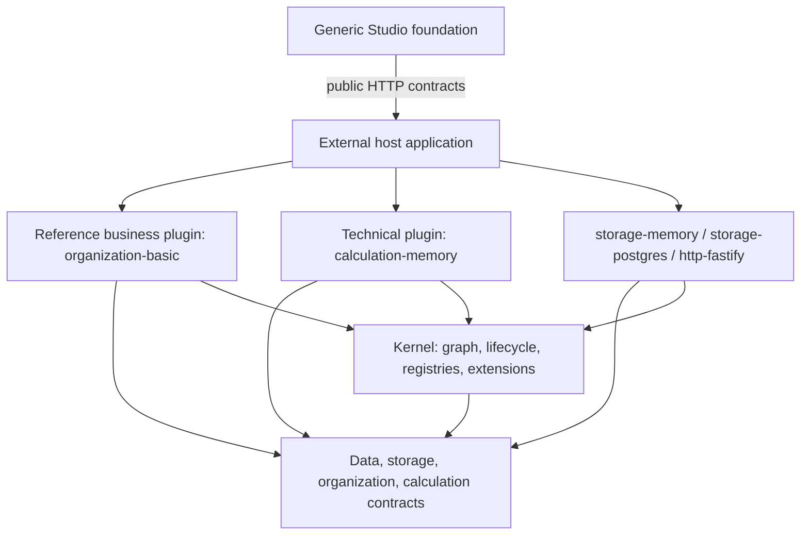

# Architecture

Prism Core composes a generic Kernel, typed contracts, selectable plugin implementations, and host-owned exposure. It is Apache-2.0 open source and remains independently useful without any private Solution (`LICENSE`, `NOTICE`, `docs/adr/0014-open-core-private-solutions.md`).

## Repository boundary

Hospital Performance is a separate private/commercial consumer. Core contains no hospital schemes, rules, pipelines, data adapters, customer UI or deployment configuration. A missing generic mechanism is implemented and released from Core before a Solution consumes it.

```text
Prism Core (this repository)
  Kernel / contracts / providers / testing / generic Studio
              │ public versioned packages
              ▼
Private Solutions (separate repositories)
  domain plugins / rules / adapters / customer UI / deployment
```

## Layers



Dependency direction is one-way. Kernel has no HTTP, PostgreSQL, Organization, Pipeline, Studio or domain concept. Typed extension points let plugins register routes, calculation operations and backends without adding those concepts to Kernel.

## Capability and Plugin

A Capability is a typed contract identified by a stable token ID and versioned separately from implementation packaging. A Plugin is one concrete provider/consumer and lifecycle boundary.

Rules:

1. The host supplies plugins explicitly; V0.1 has no runtime package download.
2. Consumers declare Capability requirements, never concrete provider packages.
3. One Capability ID has one provider in a composed graph.
4. Undeclared service access throws `CAPABILITY_UNDECLARED_ACCESS`.
5. Provider suffixes are deliberate: `storage.memory`, `storage.postgres`, `calculation.memory`, `organization.basic`, `http.fastify`.
6. Plugin internals remain normal modules; a service/repository/entity/helper is not automatically a Plugin.
7. The host may access composed capabilities because it owns the graph; plugins remain restricted to `requires`.

Kernel identities validate before registry/graph insertion. Plugin, Capability
and Extension IDs are dotted plugin-safe ASCII ≤ 128; exact versions are semver
≤ 64. Plugin engine ranges are valid semver ranges ≤ 256, descriptions are
control-free ≤ 512, and requirement-map keys use identifier syntax ≤ 128.
Typed constructors fail fast. Resolver validation repeats for cast/plain
definitions and emits only `KERNEL_IDENTITY_INVALID` with plugin index/field;
invalid values never become map keys, graph edges, inspection data, callbacks
or diagnostic payloads.

## Kernel boundary

Kernel owns:

```text
Plugin model and lifecycle
Capability registry and semver resolution
Dependency graph and cycle rejection
Runtime Context
Resource/configuration/presentation registries
Typed extension registry
Diagnostics and inspection
Bootstrap and cleanup
```

Kernel refuses to know:

```text
HTTP / Fastify
PostgreSQL / Kysely
Organization domain
Pipeline operators and physical backends
Studio/Vue
private Solution concepts
```

## Lifecycle

```text
discover -> resolve -> register -> migrate -> start -> stop
```

- Resolution validates plugin IDs, missing/duplicate providers, semver ranges and cycles before callbacks.
- Register provides capabilities and contributes resource/extension definitions.
- Capability registration freezes before start.
- Providers start before consumers and stop in reverse order.
- On register/start failure Kernel invokes `stop` for the failing plugin, cleans earlier runtimes in reverse order, and rebuilds registries before retry.
- `bootId` increments after each successful boot so cross-boot caches can invalidate.
- Event subscriptions and the migration journal survive a boot cycle; capability/resource/extension/diagnostic stores do not.

External side effects inside `register` are not automatically transactional. Plugins must make `stop` safe after partial initialization.

Plugin-thrown `PrismError` diagnostics cross register/start/stop unchanged.
Other callback failures are sanitized: register/start use
`Plugin lifecycle callback failed.` and cleanup uses
`Plugin lifecycle cleanup failed.` with plugin ID plus a bounded safe error type
only. Callback messages, custom objects, endpoints, credentials and stacks
never enter startup exceptions or retained inspection diagnostics; cleanup
ordering/best-effort isolation is unchanged.

EventBus metadata is bounded before handler-map access or wildcard expansion.
Published types are ≤ 128-character dotted ASCII plugin names with ≤ 16
segments. Subscriptions are exact, global `*`, or one trailing `.*`. Optional
correlation IDs use the same ≤ 128 ASCII-safe shape as HTTP; explicit empty is
invalid. `EVENT_METADATA_INVALID` registers/delivers nothing. Subscriber
failures remain isolated and reported without aborting later handlers.

## Configuration, service and presentation

`Service Contract` is the normal typed API used by programmers. `ConfigurationContract<TSpec>` defines the JSON-editable behavior exposed to business users. `PresentationSpec` supplies labels, help, grouping, ordering and editor hints without changing semantics.

```text
Presentation -> Configuration Contract -> Capability -> Kernel
```

No service automatically becomes an API, pipeline node or page. Exposure is deny-by-default. V0.1 enforces:

- `configuration` for generic Resource discovery/creation;
- `pipeline` for the operation palette.

Other exposure names are reserved metadata. HTTP exists only through explicit route contributions.
`http.fastify` never treats browser-supplied principal or role headers as
identity. The composing host may provide a trusted `principalProvider` after
validating its session/token; absent that provider the request is anonymous.
An explicit `devPrincipal` exists only as a local-development/test seam.
Every provider/dev identity then crosses one strict Principal projection before
`CallContext`: id ≤ 128, optional display name ≤ 256, ≤ 64 roles of ≤ 128 and
≤ 256 permissions of ≤ 256 characters. Values must be nonempty strings without
ASCII controls/DEL; arrays are string-only and exact-deduplicated. Nothing is
truncated—especially permissions—because truncation could change authorization.
Invalid provider output returns sanitized `AUTHENTICATION_PROVIDER_INVALID`
before authorization, audit, logging or route execution. Host-owned `system`
role semantics remain exact.

`x-as-of` accepts only a real ISO calendar date or RFC3339 datetime before it
enters effective-dated business logic. `x-correlation-id` is limited to 128
ASCII identifier characters before it enters logs, traces, events or durable
audit. Invalid request metadata returns `HTTP_REQUEST_INVALID`/`400`; error and
not-found rendering uses a server-generated safe correlation ID rather than
echoing rejected input. Responses echo the validated or generated correlation
ID, and structured diagnostics map authentication, authorization, conflict,
validation and internal failures to distinct HTTP statuses.

HTTP diagnostic projection never mutates internal diagnostics. Status selection
uses internal codes first; the public copy redacts token/secret/password/value
and provider `cause/error/stack/exception` fields. Responses are capped at 25
diagnostics with an explicit omission marker. Code/message/path/nodeId, detail
keys/strings, arrays, objects and nesting are deterministically bounded with
`[TRUNCATED]`/`[DEPTH_LIMIT]` markers, preventing provider-error disclosure and
diagnostic amplification.

Each route receives a transport-owned `CallContext.signal`. Client request
aborts and premature response-socket closure abort it exactly once; normal
response completion does not. HTTP lifecycle listeners are detached after the
handler exits. Route-supplied response headers are applied before the validated
transport correlation header, so application code cannot forge request
identity.

Every `HttpRoute` declares either `public` access or one exact permission.
`http.fastify` enforces that metadata before the handler; omission is a type
error, anonymous access is `401`, and authenticated principals without the
permission receive `403`. Roles are host policy inputs only—route decisions use
resolved permissions, with a deliberate `system` service-identity bypass.
Critical production mutations additionally require a bounded
`x-change-reason`, which enters `CallContext` and the durable audit record.

`createOidcPrincipalProvider` validates RS256 signatures, issuer, audience,
expiry and not-before claims, then maps configured role and permission claims.
JWKS loading is single-flight and bounded by a fetch timeout. A warm-cache
`kid` miss or signature mismatch triggers one cooldown-limited refresh and
retries verification in the same request, covering both new-`kid` and same-`kid`
rotation without allowing arbitrary tokens to create refresh storms. Only RSA
keys whose optional `alg`, `use` and `key_ops` metadata is compatible with
RS256 verification are accepted. Algorithm substitution, malformed claims,
forged browser headers and unavailable identity infrastructure fail closed.
JWKS JSON decoding has an independent positive safe-integer cap, default 1 MiB.
Oversized or malformed `Content-Length` is rejected before body access; chunked
bodies are cumulatively limited and cancelled on overflow. Declared-length
mismatch, missing/failed streams, invalid UTF-8 and malformed JSON return
`AUTHENTICATION_PROVIDER_INVALID` without JWKS/key/token content. Network and
timeout failures remain `AUTHENTICATION_PROVIDER_UNAVAILABLE`.
The HTTP OpenTelemetry bridge extracts W3C propagation context and records route
templates, status, duration and correlation ID without request bodies,
configuration values or credentials.

`plugin-observability-otel` installs the Node OpenTelemetry SDK with OTLP/HTTP
trace and metric exporters, service/version/environment/deployment resource
attributes and periodic metric export. TLS is required by default. Its
`otel-exporter` readiness probe requires the SDK to be started and a live
collector health endpoint; exporter authorization headers never enter evidence.

Production-mode HTTP startup is a hard deployment gate. It rejects a
development principal, missing trusted identity/telemetry, or absent evidence
for single-tenant isolation, production Artifact/Secret providers, audit-chain
verification and WORM export, PostgreSQL PITR, approved RPO/RTO, a successful
restore drill, container-level Worker isolation, OTLP export, signed SBOM,
plugin compatibility and migration preflight. External controls remain owned
by the deployment; Core requires their live evidence instead of pretending a
local provider is production infrastructure.

## JSON persistence boundary

Resource specs and documents are `JsonValue`. Both storage providers call the same `assertJsonValue` guard. It rejects values JSON cannot preserve honestly: `undefined`, non-finite number, `bigint`, function, symbol, `Date`, `Decimal` and class instances.

Domain objects cross persistence through paired codecs:

```text
Domain value -> Codec.encode -> JsonValue -> provider
provider -> JsonValue -> Codec.decode -> Domain value
```

Memory does not define looser semantics than PostgreSQL. This rule was introduced after in-memory object retention hid prototype-loss bugs that a real JSONB round trip exposed (`packages/contracts-data/src/json.ts`, `packages/plugin-storage-memory/src/memory-storage.ts`).

Storage identifiers are provider-independent and validated by both raw
providers before query, mutation or audit. Resource kinds and collection names
are ≤ 128-character ASCII plugin namespaces; AtomicWrite request IDs are
≤ 256-character ASCII identifiers. Resource/Document entity IDs are nonempty,
control-free and ≤ 256; Resource names are nonempty, control-free and ≤ 512.
Malformed unknown Resource kinds are rejected even though valid unknown kinds
retain raw-provider behavior. Rejection emits `STORAGE_IDENTIFIER_INVALID` and
performs no mutation/audit.

Audit attribution is validated at every raw mutation boundary before business
state changes: principal ID ≤ 128 control-free; correlation ID ≤ 128
ASCII-safe; optional change reason ≤ 500 control-free; optional approval ID
≤ 128 with `[A-Za-z0-9_-]`. Invalid attribution returns
`STORAGE_AUDIT_CONTEXT_INVALID` with field only and produces no Resource,
Document, AtomicWrite or audit mutation. Reads deliberately remain available
under an invalid mutation context for recovery/diagnosis.

Document/Atomic cardinality is also shared: `getMany`/`putMany` ≤ 1,000;
Atomic preconditions/operations ≤ 1,000; query equality fields ≤ 32 and order
terms ≤ 8. Query field names are nonempty/control-free ≤ 128. Explicit
limit/offset must be nonnegative safe integers and limit ≤ 10,000; malformed
numbers are rejected, never clamped. Omitted limit remains available for
trusted internal full scans. Violations return `STORAGE_QUERY_INVALID` or
`ATOMIC_WRITE_INVALID` before SQL expansion, sorting/copying, locks, mutation
or audit.

`where` values are runtime-validated as exactly null, boolean, finite number or
string; strings are ≤ 1,024 UTF-8 bytes. Undefined, bigint, arrays, objects,
NaN/Infinity and oversized multibyte values return `STORAGE_QUERY_INVALID`
before provider work. PostgreSQL JSON serialization and Memory `Object.is`
therefore cannot create different query semantics.

Atomic `document-present.fields` reuses the same 32-field/name/scalar/string
rules but reports `ATOMIC_WRITE_INVALID`. Validation precedes advisory locks,
document reads, snapshots, operations and audit, removing the same
`JSON.stringify`/`Object.is` divergence from compare-and-swap preconditions.

AuditJournal list queries are wrapped identically: `afterSequence` is a
nonnegative safe integer; explicit limit is `1–1,000`; target kind/ID reuse
Storage namespace/entity rules. Omitted limit remains an internal full scan.
Malformed queries return `STORAGE_QUERY_INVALID` before Memory filtering or
PostgreSQL predicates/limits; chain verification is unchanged.

## Resource revisions and PostgreSQL

Logical identity and revision content are separate:

```text
resource(kind, id, current_revision, timestamps)
resource_revision(kind, id, revision, status, name, spec jsonb, timestamps)
document(collection, id, body jsonb, timestamps)
prism_migration(plugin_id, migration_id, checksum, applied_at)
audit_journal(sequence, actor/action/target, before/after fingerprints,
              reason, correlation_id, approval_id, previous_hash, entry_hash)
```

Lifecycle:

```text
draft -> published -> archived
draft ----------------> archived
```

Storage plugins expose a provider-independent validation facade over their raw
Resource store. For every registered kind, `saveDraft` applies the Resource
JSON Schema and semantic validator before mutation. `publish` reloads and
revalidates the exact draft against current published references, then publishes
with that draft's `updatedAt` as its compare-and-swap token. This makes HTTP,
CLI, seed and plugin entry points identical and closes draft validation/publish
races. Raw provider constructors and unregistered kinds remain available for
storage conformance, migrations and defense-in-depth corruption tests.

Published content is permanently immutable. PostgreSQL enforces this with a `BEFORE UPDATE` trigger; it also blocks published-to-draft and every transition out of archived, closing two-step thaw/mutate attacks. `0002_immutable_revision_status` updates already-migrated databases rather than silently editing `0001` (`packages/plugin-storage-postgres/src/migrations.ts`).

Migrations belong to the plugin that owns the tables. Kernel orders/runs them and writes successful IDs through a journal. V0.1 migrations are forward-only and must be idempotent. A journal created from a connection string owns a separate pool; its creator calls `dispose()`.

`storage.atomic-write` accepts a declaration of document preconditions and put/delete operations. It never exposes a transaction callback or provider client. One provider executes one plan: memory applies it to temporary collection copies before swapping them, while PostgreSQL evaluates it inside one database transaction with advisory locks for absent-document races. Cross-provider transactions and Resource mutations are outside the V1 contract.

Memory and PostgreSQL import one provider-independent `describeStorageContract` suite. CI uses real PostgreSQL 17 and fails if the persistence suite executes zero tests.

Memory and PostgreSQL implement the same `AuditJournal` contract. Resource,
Document and AtomicWrite mutations append actor/action/target plus content
fingerprints; raw specs, document bodies and secret values are not retained in
the journal. PostgreSQL writes the business mutation and audit row in the same
transaction, serializes hash-chain appends with an advisory transaction lock,
and installs a trigger that rejects `UPDATE` and `DELETE`.
`storage.audit-export@1.0.0` exports records by sequence and entry hash.
`storage.audit-export.s3` writes deterministic JSON objects with conditional
create, SHA-256 checksum and S3 Object Lock `COMPLIANCE` retention; retries read
and compare the existing bytes instead of overwriting. Both export and remote
verification first run the durable journal's full local hash-chain
verification. A broken source returns `AUDIT_EXPORT_SOURCE_INVALID` before any
S3 read/write, preventing corrupted records from becoming immutable WORM
evidence. Remote byte comparison is a second check, not a substitute for source
integrity. Its readiness probe requires Bucket Versioning and Object Lock.
EventBus and application logs are not audit substitutes.

Export ranges validate before chain verification: `afterSequence` is a
nonnegative safe integer and `limit` is an integer `1–1,000`; defaults remain
`0/1,000`. No clamp/truncate behavior exists. `AUDIT_EXPORT_RANGE_INVALID`
returns field only and causes zero journal verify/list or S3 I/O.

Every WORM verification read carries the exact deterministic serialized-record
byte cap. S3 `ContentLength` is rejected before stream access when oversized;
Web and Node streams are bounded and cancelled/destroyed on overflow.
Declared/actual mismatch returns `AUDIT_EXPORT_OBJECT_SIZE_MISMATCH` without
record/body content. `transformToByteArray` is not used.

Migrations declare a SHA-256 checksum, risk, backup requirement and external
effects. Engine startup preflights every pending migration before running any
`up`, blocks missing backup/external-effect approval, and rejects checksum drift
for already applied migrations. Older journal rows without checksums remain
recognized and are never replayed.

Kernel validates all migration metadata with plugin identity before graph,
journal, approval, preflight or lifecycle work. `migrations` is an array with
unique plugin-safe IDs (1–128 characters), lowercase SHA-256 checksums, the
`low`/`medium`/`high` risk enum, a Boolean backup requirement, callable `up`
and optional `preflight`, and at most 16 nonempty control-free external-effect
descriptions of at most 256 characters each. Invalid typed definitions fail at
construction. Invalid plain definitions are skipped with sanitized
`KERNEL_IDENTITY_INVALID`; their journal, approval and plugin callbacks are
never called.

Kernel queries the migration journal only for plugins that declare migrations,
then validates the complete snapshot before allocating its lookup map or
performing approvals, preflight, migration execution or plugin start. A
snapshot contains at most 10,000 plain rows with unique plugin-safe IDs and
either no checksum (legacy) or one lowercase SHA-256 checksum. Malformed,
duplicate or oversized snapshots fail with sanitized
`MIGRATION_JOURNAL_INVALID` metadata (`pluginId`, `field`, optional
`entryIndex`); journal values are never echoed. Valid checksum drift continues
to report the canonical expected and actual hashes.

PostgreSQL storage operations, durable migration-journal calls and schema
migrations share one provider-error boundary. An explicit `PrismError` crosses
unchanged. Every other provider failure retains the operation-specific safe
code/message and only a bounded alphanumeric error type (`Error` for unsafe
names, JavaScript `typeof` for non-Errors). Raw libpq/Kysely messages, query
text, endpoints, credentials, objects and stacks never enter diagnostics,
Engine inspection or HTTP serialization.

`PostgresStorage.productionReadiness` reports the real server major version,
WAL level, archive mode, recovery role and audit-chain verification. This can
prove that PITR prerequisites are configured; it cannot prove a backup is
restorable. A dated restore-drill result and approved RPO/RTO remain separate
deployment probes.

`scripts/verify-postgres-restore.mjs` is the deployment restore drill. It
requires distinct source/disposable target databases, a target name prefixed
`prism_restore_verify_`, and an exact destructive confirmation value. It
performs schema-scoped `pg_dump`/`pg_restore`, compares logical data hashes,
checks every audit-chain link and writes permission-0600
`backup-restore.verified` evidence without connection credentials.

## Arrow Dataset boundary

`Dataset.stream()` yields Arrow-backed `DataBatch`, not `Row[]`. Logical Prism schemas map to Arrow schema/metadata; decimal columns carry required precision and scale. `Row[]` remains an explicit materialization escape hatch for JSON edges, fixtures and the current row-oriented memory backend.

Domain point queries may return objects/maps while batch consumers use Dataset. This avoids per-row Capability and future FFI calls.

Organization Dataset providers defer storage access until the first stream,
then share and cache one immutable materialization across concurrent and
repeated streams. Later organization mutations require a newly-created Dataset
and a failed materialization remains failed for that Dataset.

## Calculation

```text
PipelineSpec
    ↓ infer / normalize / lower
SemanticPlan       serializable, deterministic, typed, versioned
    ↓ backend lowering
ExecutablePlan
    ↓
CalculationBackend
```

Operations infer and lower; they do not execute. SemanticPlan contains no closure or runtime object. MemoryBackend owns JS evaluators internally. V0.1 selects one backend for the whole plan; arbitrary node-level backend hopping is deferred.

The calculation contract includes safe expression AST, Join cardinality checks, first-class Lookup policies, ordered Decision, exact Decimal Aggregate, conservation-preserving Allocate, Validate, trace and explain metadata.

Optional compiler semantics use public extension contracts, not Kernel branches. Type and Plan analyzers return explicit `not-applicable | handled | invalid`; multiple handlers conflict, required analyzers cannot disappear silently, and exact extension contract plus analyzer semantic versions enter SemanticPlan v2 and `planHash`. Typed `SemanticAnnotation<JsonValue>` facts survive Arrow/JSON round trips. Static analyzers may also emit `PlanConstraint` records for Snapshot/Runtime enforcement of actual data facts; Runtime does not re-infer static meaning (`packages/contracts-calculation/src/analysis.ts`, `packages/contracts-data/src/semantic-annotation.ts`, `packages/plugin-calculation-memory/src/analysis.ts`, `docs/adr/0015-compiler-semantics-are-plugin-extensions.md`).

## Run evidence

Core defines evidence structures independent of any domain Solution:

```text
Run identity =
  DefinitionRef + DefinitionFingerprint
  + Dataset/Parameter fingerprints
  + Effective time
  + Engine/Operation/Backend/Business-component versions
  + Semantic plan hash
```

A definition reference locates content; its fingerprint verifies content. Parameter declarations affect plan identity; bound values affect input identity. Backend and business-component versions belong to run identity, not plan identity (`packages/contracts-data/src/run-pin.ts`).

Durable bitemporal replay remains a Solution/host responsibility: Dataset fingerprints are evidence, not a materialized snapshot, unless the selected storage/input provider guarantees that snapshot.

## Unified project materials

Visual and code authoring share one project material identity and registry:

```text
Visual Definition Resource ─┐
                            ├─ MaterialManifest ─ Project Release ─ Runtime
Code Module Artifact ───────┘
```

`authoringMode=VISUAL` means the structured Definition is authoritative. `authoringMode=CODE` means the source tree and built artifact are authoritative. Prism does not promise a lossless conversion from arbitrary TypeScript back into a visual graph. A Project Release pins every visual Resource revision/fingerprint and every code source revision, dependency-lock hash and artifact hash.

Plugins contribute `formula`, `operator`, `action`, `data-source`, `report`, `page-component` and `field-component` manifests through `project.materials`. `project.material-registry` is the single discovery surface used by visual editors, code tooling and runtimes; a duplicate material id/version is rejected rather than selected by plugin order.

The catalogs are intentionally scoped:

```text
Installed catalog      Plugin contributions; globally browseable
Draft catalog          Current Project Draft declarations; DECLARED / NOT_BUILT
Release catalog        Exact built Code Materials pinned by a future Project Release
```

Selecting the highest installed version is a design-time convenience only. Published definitions and runtimes always use an exact material id, version and source identity. Publishing a Project Source does not register its declarations globally and does not make them runnable.

Code Project edits use a `project.source-drafts` Document with `draftVersion` CAS. Keystrokes update that Document; they never create Resource revisions. Publication normalizes UTF-8 text to LF, validates NFC project-relative POSIX paths and case-fold collisions, sorts files, computes a canonical SHA-256 tree fingerprint and creates an immutable `project.source` Resource revision. Phase 2 stores text files only and reads Material declarations from `prism.materials.json`; executable artifacts and Project Releases begin only after a real build.

Source and Artifact trees call the same `contracts-data`
`isPortableRelativePath` predicate for empty/dot segments, controls,
Windows-reserved characters, trailing dot/space and device basenames. Source
requires the submitted path to already be NFC and uses locale-independent
lowercasing for collision checks; invalid aliases fail before Draft copying or
CAS. This is a clean cutover with no legacy path normalization.

Source-tree limits apply at the capability boundary, not only HTTP: 256 files,
512 path characters, 128 media-type characters, 4 MiB UTF-8 per file and
16 MiB aggregate UTF-8. A preflight computes byte/count/metadata diagnostics
before LF-normalized copies, Draft CAS, Resource publication, fingerprinting or
Build IPC. Rejected saves do not advance `draftVersion`; publication reuses the
same validator, so every Build inherits the bounded-tree invariant.

Visual Pipeline authoring is build-scoped. `project.build` derives an exact
Visual Material catalog from the immutable Build Artifact Set; each item
contains the full server-generated `ExactProjectMaterialRef`, its manifest and
schema-derived `visualPropertyFields`. Studio never reconstructs artifact or
manifest fingerprints. A single structured `VisualPipelineSpec` covers
identity, inputs, nodes, exact materials, configurations, bindings and outputs.
Draft saves use Resource `updatedAt` CAS, return build-aware diagnostics and
preserve structurally valid but configuration-incomplete work. Publishing
revalidates the exact Build and every Material, atomically rejects stale Drafts,
publishes the Visual Resource, and composes an idempotent Project Release that
pins its revision and fingerprint. Server-side Diff compares the saved Draft
with the published revision; unsaved browser state is never represented as a
canonical Diff.

Project builds begin from an exact published Source revision. `project.build`
stores a CAS-transitioned Build Request, forks a bounded Build Worker process,
materializes the canonical tree, performs
`pnpm install --frozen-lockfile --ignore-scripts`, TS7 `--noEmit`, Vitest, Vite
client build and esbuild server/material builds, then verifies every declared
export. The Worker receives an allowlisted environment, an old-space limit,
bounded command output and command/overall timeouts. Failed
typechecks/tests/builds persist diagnostics and logs but create no Project
Release.

The parent Worker boundary settles exactly once across protocol response,
process error, any exit code, send failure and timeout. Exit `0` without a
protocol response is a failure, not a 15-minute wait. Send/timeout failure kills
the child. One `finally` clears the timer and every listener and disconnects the
handle; competing late events cannot overwrite the selected sanitized result.

Build Worker response limits are shared with the parent: at most 256 Artifact
files, 16 MiB per file, 64 MiB aggregate Artifact bytes, 128 Materials, 256
Action IDs, 1,000 logs, 2,048 characters per log and 4,096 failure characters.
The Worker stats generated files and consumes the aggregate budget before
`readFile`; limit breach becomes sanitized
`PROJECT_BUILD_OUTPUT_TOO_LARGE`. The parent revalidates every launcher response
before Artifact storage or Build persistence, so a non-conforming provider
cannot bypass the limits.

Raw Worker stderr is always drained. The shared collector retains at most
65,536 bytes and 256 chunks with `[WORKER_STDERR_TRUNCATED]`; Build failure logs
receive only that bounded projection. Runtime attaches a discard/drain listener
for the full handle lifetime because its structured logger is the only
persistent output surface. Exit/dispose removes the listener, preventing pipe
backpressure and completed-handle retention.

A pre-aborted Build is rejected before Source lookup or Build persistence. Once
the request reaches `RUNNING`, Worker launch/execution cancellation is
terminalized as `FAILED/PROJECT_BUILD_CANCELLED`; other launcher exceptions
become `FAILED/PROJECT_BUILD_FAILED` without raw infrastructure error text.
When the caller signal is already aborted, the terminal CAS uses a signal-free
system recovery context with the original correlation ID. Terminal persistence
failure still propagates; the system does not claim a transition it could not
store.

After Worker success, Artifact bytes are written content-addressably before
publication. Artifact Set construction is pure; one AtomicWrite then creates
the Artifact Set, replaces `RUNNING` with `SUCCESS`, and persists Build logs and
Artifact descriptors. No reader can observe an Artifact Set for a non-successful
Build. Artifact provider/finalization failure attempts a terminal
`FAILED/PROJECT_BUILD_FINALIZATION_FAILED` transition with the same recovery
context; already-written immutable bytes may remain unreferenced. If the atomic
success write or recovery write itself fails, that storage error propagates.

`artifact.store@1.0.0` is the only Build/Runtime Artifact boundary. Canonical
path normalization, duplicate detection, file ordering, manifest parsing and
`sha256/<prefix>/<hash>` object keys live in `contracts-artifact`, so providers
cannot silently implement different identities. Artifact hash v2 uses a fixed
domain/version tag plus unsigned 64-bit length frames for content type, file
count, every path and every content byte sequence. Structural boundaries cannot
collide before SHA-256. This intentionally changes every pre-v2 hash; existing
development Artifacts must be rebuilt. There is no v1 compatibility or
dual-identity path. Build submits immutable file trees; Runtime uses `stat`,
`read` and full verification.

The shared path namespace is provider-portable: NFC POSIX-relative segments are
non-empty and never `.`/`..`. Windows-reserved controls and
`< > : " | ? *`, trailing dot/space, and device basenames
`CON/PRN/AUX/NUL/COM1-9/LPT1-9` are rejected case-insensitively before an
extension. Full paths must also be unique after Unicode lowercasing. Exact
duplicates retain `ARTIFACT_PATH_DUPLICATE`; case-fold aliases use
`ARTIFACT_PATH_COLLISION`. Valid dotfiles, internal spaces and non-device names
remain legal. Invalid trees fail before Local/S3 publication. A newly renamed
Local Artifact is fully verified before `putImmutable` returns and is removed
if verification fails. This is a clean cutover; previously accepted
Windows-aliased trees must be rebuilt.

Artifact reads are manifest capabilities, not prefix-based object reads. Both
providers normalize the requested path, require an exact member in
`ArtifactStat.files` before filesystem/S3 access, and require the returned byte
length to match that member. Undeclared colocated files/objects are
inaccessible. `verify` remains the full content-hash check.

`artifact.store.local` is explicitly development-only.
`artifact.store.s3` uploads files before the manifest with conditional create,
per-object SHA-256 checksums and S3 Object Lock `COMPLIANCE` retention. If a
file key already exists, the provider reads and exact-compares its bytes before
continuing; mismatch returns `ARTIFACT_IMMUTABLE_CONFLICT` and no manifest is
written. Exact existing bytes are idempotent. The manifest is published last,
including concurrent-`exists` handling, then every declared object is read to
verify the canonical Artifact hash. Its live readiness probe requires Bucket
Versioning and Object Lock. Credentials remain in the AWS SDK host credential
chain or injected client, never Resource configuration.

Every S3 object read carries a required allocation cap. Declared
`ContentLength` is rejected before stream access when oversized; Web and Node
streams are accumulated only to the cap and cancelled/destroyed on overflow.
Declared/actual mismatch returns `ARTIFACT_OBJECT_SIZE_MISMATCH` without body
content. File reads use the exact manifest size; manifest reads use a positive
safe configurable cap, default 1 MiB. `transformToByteArray` is not used.

`secret@1.0.0` persists only `SecretRef` values. `secret.local` uses explicit
environment/file allowlists and is development-only. `secret.vault` reads one
selected string field from Vault KV v2, supports a host-owned token resolver or
Kubernetes auth, caches only leased authentication tokens, requires HTTPS by
default and probes Vault seal/initialization plus token lookup. Secret values
never enter Studio, audit, diagnostics, readiness evidence or telemetry.

Every provider first applies the shared `SecretRef` boundary: provider ID ≤ 64
plugin-safe ASCII; key ≤ 512 control-free; optional version/field ≤ 128
control-free and nonempty. Invalid runtime shapes or values return generic
`SECRET_REF_INVALID` before token resolution, allowlist lookup, environment,
filesystem or Vault URL/fetch work. Local provider configuration validates the
same provider/allowlist keys, ASCII environment names ≤ 256, absolute
control-free file paths ≤ 1,024, and positive safe file/value byte limits;
provider-specific field/version/path rules remain additional checks.
Local environment values and files default to 64 KiB limits. File resolution
opens one handle, preflights type/size, bounded-reads size plus one byte, then
re-stats handle and path with size/device/inode equality before fatal UTF-8
decode and one terminal-newline trim. Oversize/invalid environment and file
values return generic `SECRET_VALUE_INVALID`/`SECRET_FILE_INVALID` without path
or value content.

Kubernetes authentication is single-flight and caches only the leased Vault
token. A secret-read `401`/`403` invalidates that exact token, performs one
re-login and retries once in the same request; concurrent recovery shares the
login. Login failure clears the flight for a later request. Every Vault fetch
has a validated positive timeout and maps transport/timeout failure to
structured Secret diagnostics without JWT or token content.

Vault authentication inputs are independently bounded: host/Vault client tokens
≤ 16 KiB UTF-8; Kubernetes JWT file ≤ 64 KiB; role ≤ 128, auth mount ≤ 64,
namespace ≤ 256 and JWT path ≤ 1,024 control-free characters. JWT loading opens
one file handle, preflights type/size, reads at most the bounded size plus one
growth byte, then re-stats the same handle to reject growth/shrink/replacement
races. Invalid configuration/token/file input returns generic
`VAULT_CONFIGURATION_INVALID`/`VAULT_AUTHENTICATION_FAILED` before header or
network use and exposes no token/JWT/path.

Vault JSON decoding is bounded independently of request timeout. The default
limit is 1 MiB and host configuration must be a positive safe integer.
Declared `Content-Length` is rejected before body access when oversized;
chunked bodies are cumulatively limited and cancelled on overflow. Declared
length mismatch, missing/failed stream, invalid UTF-8 and malformed JSON all
return `VAULT_RESPONSE_INVALID` without response, token or JWT content.

Successful Builds freeze an immutable Artifact Set but do not publish a
Release. A separate `project.release.publish` operation—bound to an exact
Approval—composes the immutable `project.release` Resource. Visual Pipeline
publication may compose its matching Release under the same approved exact
mutation. A Release fixes Source revision/fingerprint, package and lock hashes,
Node/pnpm/builder versions, Runtime ABI, required client/server exports, Action
identities, verified Artifact refs, test result and exact built Code Material
identities. `buildReproducibility` describes the pinned toolchain;
`runtimeReproducibility` remains `UNKNOWN` until each Action Run records
observed semantics.

`project.runtime-abi@1.0.0` requires client `mount` and server `actions` exports. Before activation, `project.runtime` verifies the Release fingerprint, every Artifact hash and ABI, starts a Candidate Worker, and compares its READY handshake—Release identity, ABI, Server hash, Action ids and Material identities—to the Release. Only then does one AtomicWrite CAS the desired Active pointer and append an immutable Activation record. A successful swap routes new calls to the Candidate and drains the prior worker; any health/manifest/CAS failure stops the Candidate and preserves the old Release.

Candidate READY startup settles exactly once across `ready`/`ready-failed`,
process error, any exit code, initialization send failure and health timeout.
Exit `0` without READY fails immediately. One `finally` removes startup
message/error/exit listeners and the timer; every non-matching outcome disposes
and disconnects/kills the Candidate before returning a sanitized Runtime
startup diagnostic. The long-lived exit listener remains after successful
READY so later unexpected exits retain bounded restart behavior.

Before a Worker handle exists, Runtime owns the release-scoped temporary
directory. Filesystem/materialization/launcher failure removes it immediately.
After handle construction, `ReleaseWorker` owns cleanup through disposal/exit.
Non-Prism provider failures are normalized to
`PROJECT_RUNTIME_START_FAILED`; only that sanitized message enters FAILED
Runtime Instance state or API diagnostics. Existing structured cancellation,
Artifact, ABI and Runtime Profile diagnostics retain their exact codes.

Each Server Worker creates its own lightweight Prism Engine. The default profile uses `prismPlatform`; a host may supply a runtime-profile module that contributes hospital/performance or other runtime-safe plugins. The Worker never installs HTTP, Studio, Build Manager or Runtime Manager itself. Project Actions receive that Worker-local Engine through the frozen ABI instead of remote proxying arbitrary Capability objects.

Build and Runtime require `worker.launcher@1.0.0`; neither calls `fork`
directly. The launcher owns process/container/VM creation, IPC message
transport, stderr, lifecycle and explicit mounts. `worker.launcher.local`
implements the contract with a child process for development and tests. It does
not inherit arbitrary host environment variables; Build lifecycle scripts are
disabled, workers have memory/time/output limits, and runtime cancellation
remains enforced.

Launcher cancellation is provider-independent. A pre-aborted launch rejects
with `WORKER_LAUNCH_CANCELLED`; an abort after launch kills the owned process or
container. Exit, launch error, IPC disconnect and explicit kill detach the
signal listener, so completed Worker handles and request contexts do not retain
each other. Both launchers attach then immediately recheck the signal, closing
the abort race at provider startup.

Parent-side Action and Code Material requests share one lifecycle: a
pre-aborted `CallContext` is rejected before IPC, cancellation sends one
request-scoped cancel message, and listener/pending/in-flight state is removed
on every exit. Any Action or Material timeout marks the Worker unavailable and
kills it; the next request lazily starts a clean Worker for the same persisted
Active Release. A timed-out module is never left executing inside a reusable
Worker.

Runtime protocol output is bounded on both sides of IPC. Worker and parent share
one limits module: result JSON ≤ 1 MiB, ≤ 100 logs, log messages ≤ 1,024
characters, and errors ≤ 4,096 characters. Worker rejects non-JSON/cyclic output
as `PROJECT_ACTION_OUTPUT_INVALID` and oversized JSON as
`PROJECT_ACTION_OUTPUT_TOO_LARGE` before send. Logs/errors are truncated with
explicit markers while accumulating; the parent revalidates and sanitizes every
launcher response before Run/log persistence. Invalid output does not poison
the Worker, so later requests remain usable.

Request IPC send failure resolves the request as sanitized
`PROJECT_RUNTIME_DISCONNECTED`, marks the Worker unavailable and disposes it;
raw transport/provider text never reaches Runs or direct callers. If the
request-scoped cancel message itself fails to send, the caller still receives
`PROJECT_ACTION_CANCELLED` but the Worker is invalidated/killed because
unbounded work can no longer be controlled. The next request uses the same
single-flight lazy replacement path.

Lazy Worker replacement is single-flight per Project Release identity.
Concurrent calls share one startup Promise; failure removes the flight so a
later request can retry. The flight rechecks the installed Worker before
launch, rechecks persisted Active Release before map installation, and disposes
any losing Candidate. Activation swaps against the actual mapped Worker after
its CAS and drains that exact displaced instance, preventing concurrent lazy
startup from being leaked or overwriting a newer Release.

The local launcher reports `isolation=process` and fails
`worker-container-isolation` readiness. `worker.launcher.container` provides a
Docker implementation: a small bridge converts V8-serialized length-prefixed
stdin/stdout frames to the existing child IPC protocol inside the container.
It launches an explicit non-root user with `NetworkMode=none`, read-only root
filesystem, all Linux capabilities dropped, `no-new-privileges`, bounded
memory/CPU/PIDs, a noexec tmpfs and explicit read-only mounts.

Its live readiness probe pings the Docker runtime and resolves the configured
image digest; evidence includes the enforced limits. The Worker image must
contain the bridge and exact Build/Runtime entry paths. Build images must also
contain required dependencies or an approved offline package store because
network access is intentionally disabled. A boolean configuration flag cannot
upgrade the local launcher into a sandbox.

`@prismengine/project-sdk` publishes the frozen client/action/material ABI helpers and is injected into Monaco as an editor library. A built Release carries full Material manifests aligned with immutable Material Artifact refs. The Worker materializes and imports those exact modules into a Release-scoped catalog; Actions execute them through `context.materials`. Draft declarations remain `DECLARED / NOT_BUILT`, installed Plugin materials remain global design-time catalog entries, and only Release materials are executable in formal Runtime.

Active Release is persisted desired state; Runtime Instances are rebuildable operational state. Startup scans Active pointers and restores workers. Unexpected exits are recorded and restart the same Active Release with a bounded retry count; they never silently roll back.

`/apps/:slug` is a thin Runtime Shell that reads only the Active immutable Release and imports a verified content-addressed Client Artifact. Action requests carry the Client Release identity; a stale Client receives `PROJECT_RELEASE_CHANGED` rather than silently calling a newer Server. Actions execute as JSON over parent/worker IPC with timeout/disconnect/not-found diagnostics. Runs and logs persist atomically; each RunPin fixes Project Release revision/fingerprint, input fingerprint, Server Artifact operation version, Runtime ABI/engine versions and Build Manifest plan hash. Source Drafts and unpublished Releases are never read by formal App Runtime.

## Public distribution

`@prismengine/plugin-sdk` is the supported authoring facade over Kernel and public contracts; it exports no provider implementation. `@prismengine/platform` pins compatible public package versions and supplies a composition helper that enables calculation-memory, Quantity and Grain by default plus memory storage for development. Production hosts may replace storage at the composition root. Platform defaults never erase dependency edges: plugins that require Quantity/Grain still declare their Capability requirements (`packages/plugin-sdk/src/index.ts`, `packages/platform/src/index.ts`).

Release CI builds a dedicated non-root Worker image from
`docker/worker.Dockerfile`. An injected-workspace `pnpm deploy` copies only the
Build Worker, Runtime Worker, container bridge and production dependency
closure. The image also carries the controlled offline pnpm store required by
network-disabled Builds. BuildKit emits provenance/SBOM, GHCR stores the image,
and cosign keyless-signs its digest. Deployment configuration pins that digest.

Both Worker and Host Dockerfiles also pin the build inputs themselves. The
Dockerfile 1.7 frontend is
`docker/dockerfile:1.7@sha256:a57df69d0ea827fb7266491f2813635de6f17269be881f696fbfdf2d83dda33e`;
the multiarch runtime/build base is
`node:24-bookworm-slim@sha256:ba849c60be29959425b8734d57b8b4b7d56f98edd9504c9af091d5281095a71e`.
Each Dockerfile has exactly `build` and `runtime` stages sourced through that
single pinned `NODE_IMAGE`. Deterministic validation rejects mutable frontend
or base tags, additional/unpinned `FROM` instructions and release-workflow
`NODE_IMAGE` overrides. Upgrades require an explicit reviewed digest change.

pnpm is also identified by bytes, not only version. The root `packageManager`
and every Docker Corepack preparation bind pnpm `11.21.0` to npm SRI
`sha512-UhcFvOaJkk6scvWjWHEi82JonvZXHlW6gAdv1jfBETLs/62ib61Op5xIW/3b/T1aKlsFgFp36JPeceyKbMo7sQ==`
(Corepack hex
`sha512.521705bce689924eac72f5a3587122f362689ef6571e55ba80076fd637c11132ecffada26fad4ea79c485bfddbfd3d5a2a5b05805a77e893de71ec8a6cca3bb1`).
Worker build/runtime and Host build stages declare the same immutable
`PNPM_VERSION`/`PNPM_INTEGRITY`, and the pinned setup Action selects the same
version. Deterministic validation rejects version-only Corepack preparation,
hash/version divergence and release-workflow overrides.

Node is exact as well. Root `engines.node` and pinned setup-node use
`24.20.0`; authenticated inspection of the already-pinned Node image index
resolved its linux/amd64 config with `NODE_VERSION=24.20.0`. Worker build and
runtime plus Host build and runtime each declare `ARG NODE_VERSION=24.20.0` and
fail the Docker build unless `node --version` equals `v24.20.0`. Workflow
overrides are prohibited. The official Node v24.20.0 SHASUMS256 manifest
provides independent release checksum evidence; local developer runtimes may be
older and do not satisfy the release toolchain contract.

The root Docker context is filtered before either `COPY . .`. The exact
no-negation `.dockerignore` contract excludes VCS/CI metadata, root and nested
environment/npmrc/log files, dependency trees, dist/tsbuildinfo/Turbo/coverage
caches, local pnpm stores, tests, smoke output, prepared `release/` tarballs and
evidence, generated image identity, SPDX/Sigstore files and stray `.tgz`
archives. Both Dockerfiles copy the filtered source context exactly once; both
pinned build-push steps use exactly `context: .` and cannot declare alternate
contexts or re-inclusions. Thus pre-image release evidence and local credentials
cannot become BuildKit inputs or transient build-layer content.

AWS/Vault production adapters and Worker launchers are separate packages, not
re-exports of `@prismengine/platform`. This prevents the default Studio/Runtime
composition from loading AWS SDKs or production-only transport code. A
production host imports only the providers it configures and contributes one
`worker.launcher`; Build and Runtime cannot start without that explicit
capability.

Source manifests use exact `workspace:<release-version>` internal dependencies; `pnpm pack` converts them to the same public release version without rebuilding dependency objects. Platform package tests, release preflight and tarball verification prevent an accidental floating, stale, reordered or unresolved workspace dependency from becoming a release.

Release CI runs a deterministic preflight before dependency installation,
builds, signing, container publication or npm publication. It requires the
root and every public package to share one valid version, every internal
dependency to use exact `workspace:<root-version>`, and the workflow ref to
equal `refs/tags/v<root-version>`. It queries every public package/version
from npm: only a definite `404` permits release; an existing version, transport
failure or indeterminate registry status fails closed. This prevents a rerun or
wrong-ref dispatch from reaching any release side effect when npm already owns
the version.

Every mutating path also requires GitHub to report `ref_protected=true` for the
exact `refs/tags/v<version>` ref. Normal preflight, partial npm recovery, exact
publication and image finalization receive that non-sensitive value through a
quoted environment projection and reject missing, false or noncanonical input
before registry access. Repository tag protection or a matching ruleset is
therefore a deployment prerequisite. `release-images.json` and
`publication-result.json` bind the exact ref to the exact lowercase 40-hex
source SHA, preventing npm provenance, cosign workflow identity, image SHA tags
and recovery evidence from referring to different tag targets.

The privileged release job accepts only an explicit GitHub Action allowlist.
Every `uses:` reference is pinned to a reviewed lowercase 40-hex commit; human
comments retain the intended major release line. Deterministic workflow
validation requires the exact repository, SHA and occurrence count, rejecting
mutable tags, changed commits, unknown action repositories and missing/extra
uses before review. This boundary covers checkout, pnpm/Node setup, SBOM,
cosign, Docker build/login/push and both artifact uploads—the components that
receive source, npm credentials, GHCR write access or OIDC signing authority.

The privileged execution envelope is fixed as well: `workflow_dispatch` is the
only trigger; one `ubuntu-latest` publish job has a 90-minute timeout; same-ref
dispatches serialize without cancellation; PostgreSQL 17 uses the exact local
port and bounded health command/interval/timeout/retry settings. Workflow
permissions are exactly `contents: read`, `id-token: write` and
`packages: write`; additional triggers, jobs or permissions fail deterministic
validation.

GHCR still provides no conditional tag-create compare-and-swap. An authenticated
OCI `HEAD` can detect an existing conflicting tag but cannot prevent another
writer from changing it between check and `imagetools create`; ambiguous client
failure is never treated as absence. Repository rules/operational exclusivity
remain required for human-readable GHCR tags, while deployment continues to pin
signed immutable digests.

Pinned code does not justify ambient credentials. The release job has no
sensitive job-level environment. `NODE_AUTH_TOKEN` is injected only into npm
identity/scope verification and the exact-tarball publisher; registry preflight,
builds, SBOM, Docker actions and other shell steps cannot inherit it.
`PRISM_TEST_DATABASE_URL` and `PRISM_REQUIRE_POSTGRES_TESTS=1` exist only on the
required PostgreSQL test step. Anonymous registry smoke explicitly sets an
empty npm token. Workflow validation enforces the exact binding counts and step
owners. GitHub `id-token` and `packages` permissions remain job-scoped because
Actions has no per-step permission model; immutable Action pins and explicit
credential arguments remain the mitigation for that residual scope.

Credential lifetime is bounded inside the job as well. Checkout disables
`persist-credentials`, so its GitHub-token git helper is not left for later
build or shell steps. The first GHCR login covers only digest image
build/signature verification/evidence; `docker logout ghcr.io` runs before npm
identity, exact publication and anonymous smoke. A second pinned login occurs
only after smoke and immediately before `imagetools create` attaches final
tags. Deterministic validation enforces checkout non-persistence, two exact
login occurrences, logout placement, an unauthenticated npm/smoke interval and
immediate final-login/tag ordering.

The workflow-dispatch npm dist-tag is a separate trust boundary. Normal release
accepts only lowercase ASCII tags matching
`[a-z0-9][a-z0-9._-]{0,63}` and rejects SemVer-shaped values before registry
access. The GitHub input is projected into `RELEASE_NPM_TAG`; preflight and npm
publish consume only quoted `"$RELEASE_NPM_TAG"`. Direct expression
interpolation inside shell run blocks is prohibited, so quotes, substitutions
and control syntax cannot alter the release command. Finalization recovery does
not accept or consume an npm tag.

Every workspace package identity is validated before registry URL construction,
diagnostics or anonymous smoke shell lists. Names use the exact
`@prismengine/<slug>` scope, where the 1–128-character lowercase suffix has
alphanumeric segments separated only by `.`, `_` or `-`; duplicates are
rejected. Invalid/control/flag-like names produce manifest-path-only
diagnostics. Registry smoke enumerates only manifests with `private !== true`,
so a future internal package is never queried from or installed through npm.

Worker and Host builds push digest-only canonical image names and cosign those
exact action-produced digests. They do not assign mutable version or source
tags. After npm publication and the anonymous clean-install/identity smoke
succeed, the final step attaches `<version>` and full `sha-<GITHUB_SHA>` tags
to those same digests with `buildx imagetools create`. A workflow concurrency
group keyed by the exact ref serializes dispatches and disables cancellation.
Thus a failed or superseded prepublication run can leave only untagged signed
digests; it cannot mutate a human-readable release tag.

The normal path stores version, source SHA, repository and both signed digests
in the permission-0600 `release-images.json` supply-chain artifact. If npm
publication succeeds but smoke or final tagging fails, an explicit
`finalize-only` dispatch can resume without rebuilding or republishing. Its
preflight requires the same aligned manifests and exact tag ref, canonical
`sha256:<64 lowercase hex>` Worker/Host inputs, and HTTP `200` visibility for
every public npm package; absence, transport failure or indeterminate status
fails closed. Recovery skips install, builds, tests, SBOM, image construction
and npm publication. It verifies both supplied `repository@digest` keyless
signatures against this exact repository `release.yml` identity, tag ref and
GitHub OIDC issuer, reruns anonymous clean-install/identity smoke, then attaches
the version and full source-SHA tags to those exact digests.

After build, typecheck, lint, required-provider tests and Studio build, release
CI runs actual `pnpm pack --json --pack-destination release/npm` for every
public package before SBOM, signing, GHCR or npm side effects. Each inventory
must contain exactly one matching package/version, canonical unique relative
POSIX paths, `package.json`, `LICENSE`, `NOTICE`, and every declared
`main`/`module`/`types`/`bin`/`exports` target. The reported `.tgz` must resolve
inside the dedicated directory as a nonempty regular file of at most 64 MiB.
The verifier streams each byte once into SHA-256 and npm-compatible
`sha512-<base64>` SRI, rejects growth/change during hashing, sorts evidence by
canonical package name and atomically writes permission-0600
`release-packages.json` only after all 35 packages succeed. Any failure removes
partial output; pack stderr and untrusted filenames/paths are never echoed.
Tarballs and evidence are uploaded with supply-chain artifacts.

Exact `workspace:<release-version>` specs are required because `workspace:*`
conversion was observed to reorder packed dependency keys across otherwise
identical pack runs. With exact specs, two complete active-tree preparations
produced byte-identical evidence for all 35 packages.

Custom evidence is authenticated, not merely uploaded. The prepared-package
SRI manifest and image-identity manifest are each keyless `cosign sign-blob`
signed, then `verify-blob` checked against the exact
`https://github.com/<repository>/.github/workflows/release.yml@<tag-ref>`
certificate identity and GitHub OIDC issuer before the main evidence upload.
After exact npm publication, an `always()` step signs and verifies
`publication-result.json` whenever it exists, including failure journals; the
following `always()` upload carries both the result and its Sigstore bundle.
Deterministic workflow validation fixes filenames, bundle names, identity,
issuer and sign/verify/upload ordering.

Publication consumes only the prepared `./release/npm/<filename>.tgz` files;
recursive workspace repacking is prohibited. Before the first mutation it
rehashes the complete evidence closure, derives a stable topological order from
public internal runtime/optional/peer dependencies, and fetches every exact npm
version metadata document with a 64 KiB body cap. HTTP `404` enters the publish
plan. HTTP `200` is skipped only when `dist.integrity` exactly equals the
prepared SHA-512 SRI. Mismatch, malformed/oversized metadata, other status or
transport failure aborts the whole plan with zero publication. Missing
tarballs are published sequentially with
`npm publish <exact-tgz> --access public --provenance --tag <validated-tag>`.

Normal preflight requires every version absent. An explicit `resume-packages`
dispatch allows only a mixed `200`/`404` state, reruns the full build and
deterministic preparation, then delegates the decision to exact SRI comparison;
it never blindly skips an existing immutable npm version. `finalize-only` and
`resume-packages` are mutually exclusive. The publisher atomically records
`PLANNED`, each publish result and final `VERIFIED`/failure state in
permission-0600 `publication-result.json`, uploaded with `always()` for
recovery. After mutation it bounded-polls every package and succeeds only when
all registry SRIs equal the prepared evidence. npm stderr, tokens, response
bodies and malformed metadata are never copied into diagnostics.

SRI equality does not complete publication by itself because npm dist-tags are
mutable release channels. During mixed-state planning, every existing exact
version's tag mapping must converge before the first missing package is
published; a resume with a different channel therefore mutates nothing. After
every version SRI converges, the publisher again bounded-fetches
`/-/package/<escaped-name>/dist-tags` for all public packages under the same
64 KiB response cap. The validated `npmTag` must map exactly to the root
version. A mapping to another version fails immediately; missing, malformed,
oversized, transport or other indeterminate state retries within the existing
bound and then fails. Automation never invokes `npm dist-tag add` and never
repairs or moves a channel. The publication journal records independent
integrity/tag states and reaches `VERIFIED` only after both are exact.

Release CI also sets `PRISM_REQUIRE_POSTGRES_TESTS=1`. If its configured
PostgreSQL service is unavailable, test collection fails instead of converting
the four real-provider suites into accepted skips. Local development keeps the
optional behavior. An unavailable probe reports only candidate count and
bounded error types; connection URLs, credentials, driver messages and stacks
never enter test or CI output. The required decision is reapplied to cached
probe results, so an earlier optional lookup cannot bypass the release gate.

## Production Host

`apps/host` is the executable composition root for the Project control plane.
It wires PostgreSQL and its durable migration journal, S3 Artifact and WORM
audit providers, Vault, OTLP, remote-mTLS Docker Workers, Code/Build/Runtime and
Fastify. It accepts no development principal or local provider fallback.

External readiness documents are size-limited, age-checked and SHA-256 pinned
before any provider starts and rechecked by `/ready`. The Host computes live
provider checks, continuously drains the WORM exporter and redacts
configuration, credentials, bodies, causes and stacks from structured logs.

`governance.approval@1.0.0` provides durable exact-change control. An Approval
stores permission, mutation method, route template, canonical target
fingerprint, requester/reviewer identities, reasons, status, version and
expiry. Params, bodies and Secret values are hashed transiently and never
persisted. Approval review uses AtomicWrite CAS and self-review is forbidden.
Exact targets are bounded before canonicalization/fingerprinting for every
HTTP/plugin/CLI caller: permission ≤ 128 plugin-safe characters, route path
≤ 512 control-free characters beginning `/`, change reason ≤ 500 control-free
characters, and combined canonical params/body ≤ 1 MiB UTF-8. Limit failure
returns `APPROVAL_TARGET_INVALID` before approval/audit persistence. Values are
never truncated because fingerprint equality must remain exact.

Before a critical handler runs, the Approval atomically transitions from
`APPROVED` to `CONSUMED/PENDING` with publisher and correlation identities.
The ID can never authorize a second attempt. HTTP completion hooks mark the
execution `SUCCEEDED` or `FAILED`; completion failure leaves a fail-safe
consumed Approval for operational reconciliation, never a reusable grant.

Critical Resource/Organization/Project/Visual/Release/Activation mutations bind
`x-approval-id` and `x-change-reason` into the exact fingerprint. The Host
requires the Approval requester to match the latest durable author when a prior
object exists, then requires requester, reviewer and publisher to be three
distinct principals. The mutation Audit record carries the Approval ID, making
the governance decision and resulting state transition one traceable chain.

Only one Host may own a deployment. A dedicated PostgreSQL session holds an
advisory lock derived from schema and deployment ID; a second Host fails closed.
Migration execution uses a separate per-plugin/migration session lock, so
concurrent rollouts cannot run the same DDL twice.

`deploy/helm/prism` therefore uses one replica and `Recreate` strategy until
Runtime management becomes a distributed service. The pod is non-root,
read-only, seccomp-confined and capability-free; Docker mTLS and evidence are
read-only Secret volumes. NetworkPolicy denies all traffic except labeled
client ingress, DNS and operator-declared external CIDRs.

`plugin-studio-api` explicitly adapts the remaining public Studio contracts:
configuration-exposed Resource lifecycle, Organization people/units/
assignments, and Calculation operation discovery, validation and bounded
preview execution. Generic Resource routes reject types without
`exposure.configuration=true`; Project and Visual resources therefore retain
their dedicated exact-validation lifecycles.

Studio exposes this lifecycle through a Change Approvals workspace. An
operation without an ID creates the exact request and stops; a reviewer decides
it, and a third principal repeats the unchanged operation with the approved ID.

## Generic Studio

Core Studio provides:

CI runs this flow in real Chromium against `apps/e2e-host`, a real in-memory
HTTP composition using the same Approval, Organization, Studio API and Fastify
plugins. The test switches three authenticated principals through cookies,
creates a request, reviews it, executes the mutation, and verifies
`CONSUMED/SUCCEEDED`; it does not substitute source-text assertions for the
rendered UI and transport.

```text
JSON Schema renderer
Presentation mapping
custom editor registry
expression/decision editors
Vue Flow pipeline editor
Resource revision UI
Organization reference UI
Capability inspector
```

It contains no private domain page. Offline mock data is domain-neutral. A Solution composes its own routes/pages while consuming supported public Studio APIs after those APIs stabilize.

## Toolchain

Prism source compiles with native TypeScript 7.0.2. Tools requiring the legacy Compiler API use the official TS6 compatibility alias. Runtime packages depend on neither compiler. CI fixes checker/builder parallelism; local builds use automatic defaults (`docs/adr/0013-typescript-7-native-compiler.md`).

## Known V0.1 limitations

- Migrations are forward-only and have no automatic rollback for partial external effects.
- Exposure enforcement currently covers `configuration` and `pipeline`, not every reserved surface.
- MemoryBackend materializes rows between Arrow batches; a future columnar backend removes that cost.
- Extension-point version compatibility is not resolved yet.
- Multi-tenancy is deferred; `CallContext` makes later compiler-guided addition possible.
